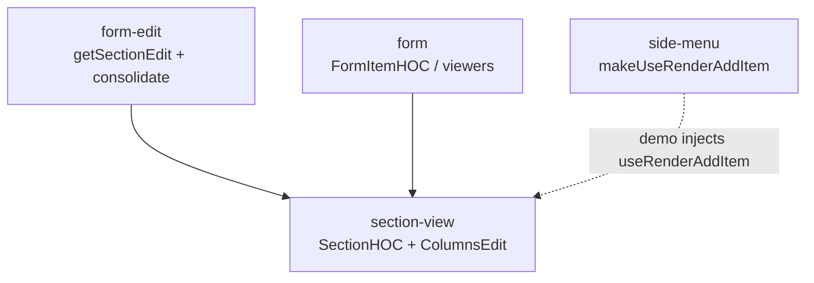

# section-view

**Section render composition** — `SectionHOC` + a non-DnD column renderer
(`ColumnsEdit`), so a section's list rendering is library composition instead
of a hand-rolled demo walk.

Migrated from `school/components/custom-form` → `react-packages/form-edit-react`
(`Section.tsx` `SectionHOC`, `renderEditFormItem.tsx`) + `ts-packages/form-edit`
(`section.data.ts` `getSectionEdit`) — default `renderEdit` is non-DnD
`ColumnsEdit`; hosts plug in DnD via `renderEdit` (see `flat-dnd/demo/WebRecursiveEdit`).

Distinct from:
- [`section-edit`](../section-edit/) — section header edit dialog + `updateSectionInFlat`
- [`form-dialogs`](../form-dialogs/) — session orchestration (`makeUseDialogs`)
- [`flat-dnd`](../flat-dnd/) — SectionNodes ↔ drag-drop-tree + web DnD `renderEdit`

## Library scope (this package)

| File | Role |
|---|---|
| `types.ts` | `NodeIndex` (`{ index, sIndex }`), `RecursiveEditProps`, `SectionProps`, `RenderFormItem`, `EditExtra` |
| `createRenderEditFormItem.tsx` | **`createRenderEditFormItem(viewers)`** — per-item viewer dispatch via `form/createFormItemByGetChild`; school `renderEditFormItem.tsx` |
| `ColumnsEdit.tsx` | **`ColumnsEdit`** — default non-DnD `renderEdit`: walks a section's columns and each item's nested panel columns, calling `render.node` / `render.addItem` |
| `SectionHOC.tsx` | **`SectionHOC({ renderEdit, useRenderAddItem, renderTitle, renderFormItem })`** — pure composition; builds `getSectionEdit` and hands it to `renderEdit` |
| `SectionFormItemHOC.tsx` | **`SectionFormItemHOC({ viewers, useRenderAddItem, renderTitle, renderEdit? })`** — thin compose of the above, defaulting `renderEdit` to `ColumnsEdit` |

`form-edit/flat-move-actions/getSectionEdit.ts` (+ `RecursiveEditManager.t.ts`)
is the pure, non-React half — school `section.data.ts` — and lives in
`form-edit` since it only touches the flat list, no rendering.

## School vs here

```
school:
SectionHOC({ renderEdit, useRenderAddItem, renderTitle, renderFormItem })
  → props => renderEdit({
       edit: getSectionEdit(edit, ctx),                  // ts-packages/form-edit
       title: renderTitle(props),
       render: { addItem, node: renderFormItem(props) },
    })
renderEdit = RecursiveEdit → FlatDnd

here:
SectionHOC(args)(props)
  → renderEdit({
       edit: getSectionEdit(props.args, props.clone, props.section, props.sIndex, props.jump),
       title: renderTitle(props),
       render: { addItem, node: renderFormItem(props) },
    })
renderEdit = ColumnsEdit (default) | WebRecursiveEdit (flat-dnd / All-in)
```



## Deviations from school

| School | Here | Why |
|---|---|---|
| `getSectionEdit`'s `setNodes` rebuilds the whole flat list (`sections.toSpliced(i,1,…).flatMap(flatten().section)`) | rewrites only the section's own span (`items.toSpliced(section.meta.index, section.meta.total, ...list)`) | same pattern as `section-edit/updateSectionInFlat`; column count never changes via `setNodes`, only item content/order within the section's existing columns — no need to touch sibling sections |
| `SectionProps` bundles `edit: SectionEditArgs` (`{ clone, actions, sections, section, i }`) + a branded `SectionExtraDom` `extra` bag | flat fields (`args`, `clone`, `section`, `sIndex`, `jump`) + a plain `itemExtra: (id) => Extra` callback | `getSectionEdit` here doesn't need the full `sections` array (see above), and there's no design-system `Extra` bag to genericize over yet |
| `RecursiveEdit`/`FlatDnd` (drag-and-drop reorder) | `ColumnsEdit` default; DnD is a host `renderEdit` (`flat-dnd/demo/WebRecursiveEdit`) | keeps `section-view` free of DnD deps — same plug-in seam school uses |

## Demo

`section-view/Section view` story: `SectionFormItemHOC` composing `field` +
`panel` viewers (name binding via `createFormItemByGetChild`, per-item move
actions via `renderCard`) into a multi-section list. Panels recurse into
nested columns with their own "+ Add" slot. Item add/edit commits immediately
via `form-edit`'s `applyFlatFormItem` (no dialog) — this story's job is
`section-view` composition alone.

The full editor with dialogs (`form-dialogs/All-in`) also uses
`SectionFormItemHOC` as its list shell (with `WebRecursiveEdit` for DnD),
display-only viewers, and Edit opening `makeUseDialogs` sessions.

## Dependency rule

Imports from: `form`, `recursive-form`, `move-actions`, `form-edit` (via `_deps`).

Does **not** import `side-menu` — `useRenderAddItem` is injected into
`SectionHOC`/`SectionFormItemHOC` (school does the same). The demo composes
`side-menu`'s `makeUseRenderAddItem` + `AddFormItem` for Storybook only.
